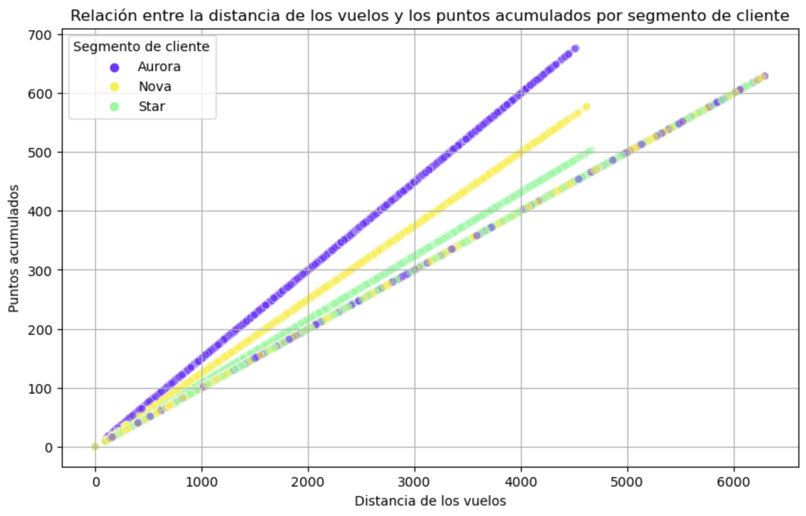

# **Análisis Exploratorio y A/B Testing de una Aerolínea Canadiense** ✈️


## **Descripción General** 📊

Este proyecto aplica técnicas avanzadas de análisis de datos, visualización y pruebas estadísticas para comprender el comportamiento de los clientes de una aerolínea canadiense. El análisis incluye la exploración de la actividad de vuelo, el nivel educativo y los grupos de fidelización del cliente.

El objetivo principal es identificar patrones clave y evaluar si existen diferencias significativas en el número de vuelos reservados entre diferentes niveles educativos utilizando un enfoque basado en A/B Testing.

---

## **Estructura del Proyecto** 🏗️

El proyecto se divide en tres fases principales, cada una enfocada en una etapa crítica del análisis de datos:

1. **Exploración y Limpieza de Datos**: 
   - Identificación de valores nulos, datos inconsistentes y anomalías.
   - Transformaciones para garantizar un dataset limpio y utilizable.

2. **Visualización de Datos**:
   - Creación de gráficos para analizar la distribución de vuelos, relación entre distancia de vuelo y puntos acumulados, y más.
   - Uso de visualizaciones para responder preguntas clave sobre la actividad de los clientes.

3. **A/B Testing y Pruebas Estadísticas**:
   - Análisis comparativo del número de vuelos reservados entre clientes de diferentes niveles educativos.
   - Aplicación de pruebas de hipótesis utilizando técnicas estadísticas como la prueba de Mann-Whitney U.

---

## **Aspectos Destacados** 🌟

### **Exploración y Limpieza de Datos**
- Identificación y tratamiento de valores nulos y atípicos.
- Conversión y ajuste de tipos de datos para preparar el dataset para análisis estadísticos.

### **Visualización de Datos**
- Gráficos para identificar patrones en la actividad de vuelo, niveles educativos y comportamiento de fidelización.
- Ejemplo: Relación entre la distancia de vuelo y los puntos acumulados por segmento de cliente.



### **A/B Testing y Pruebas Estadísticas**
- Evaluación de diferencias significativas en reservas de vuelos entre niveles educativos utilizando pruebas de hipótesis.
- Ejemplo de código utilizado para la clasificación de datos:

```python
# Categorización de niveles educativos para A/B Testing
df_filtered_ab['test_group'] = df_filtered_ab['education'].apply(lambda x: sp.categorize(x, group_a, group_b))
```

---

## **Tecnologías y Herramientas Utilizadas** 🛠️

### **Lenguajes y Librerías**
- **Python**:
  - `Pandas` y `NumPy`: Limpieza y manipulación de datos.
  - `Matplotlib` y `Seaborn`: Visualización de datos.
  - `SciPy`: Pruebas estadísticas.
  - `Scikit-learn`: Métodos auxiliares para análisis.

### **Plataformas y Herramientas**
- **Jupyter Notebooks**: Documentación interactiva y ejecución de código.
- **Visual Studio Code**: Edición y organización del código.

### **Metodologías y Técnicas**
- Exploratory Data Analysis (EDA).
- Visualización avanzada para storytelling de datos.
- Pruebas de hipótesis con enfoque en toma de decisiones basada en datos.

---

## **Resultados y Conclusiones** 📈

1. **Patrones Identificados**:
   - Clientes con niveles educativos más altos presentan una tendencia a reservar más vuelos.
   - La relación entre la distancia de vuelo y los puntos acumulados varía significativamente según los segmentos de clientes.

2. **Diferencias Significativas**:
   - Las pruebas de hipótesis indican diferencias estadísticamente significativas en el comportamiento de reserva de vuelos entre los niveles educativos.

3. **Valor del Proyecto**:
   - Este análisis proporciona insights clave para la toma de decisiones estratégicas en segmentación de mercado y estrategias de fidelización.

---

## **Cómo Ejecutar el Proyecto** 🚀

1. Clona este repositorio:
   ```bash
   git clone https://github.com/MaPitelli/airline_customer_analysis.git
   ```
2. Instala las dependencias necesarias:
   ```bash
   pip install -r requirements.txt
   ```
3. Abre los notebooks en Jupyter para explorar cada fase:
   - [Fase 1: Exploración y Limpieza de Datos](https://github.com/Adalab/bda-modulo-3-evaluacion-final-MaPitelli/blob/main/jupyters/phase_1.ipynb)
   - [Fase 2: Visualización de Datos](https://github.com/Adalab/bda-modulo-3-evaluacion-final-MaPitelli/blob/main/jupyters/phase_2.ipynb)
   - [Fase 3: A/B Testing](https://github.com/Adalab/bda-modulo-3-evaluacion-final-MaPitelli/blob/main/jupyters/phase_3.ipynb)

---

## **Sobre Mí** 👩‍💻

Soy analista de datos con experiencia en Python, SQL y visualización de datos. Mi enfoque está en transformar datos complejos en insights accionables mediante el uso de herramientas estadísticas y narrativas visuales.

📬 **Contacto**:
- **Email**: mairapitelli@hotmail.com
- **LinkedIn**: [https://www.linkedin.com/in/mairapitelli/](https://www.linkedin.com/in/mairapitelli/)

---